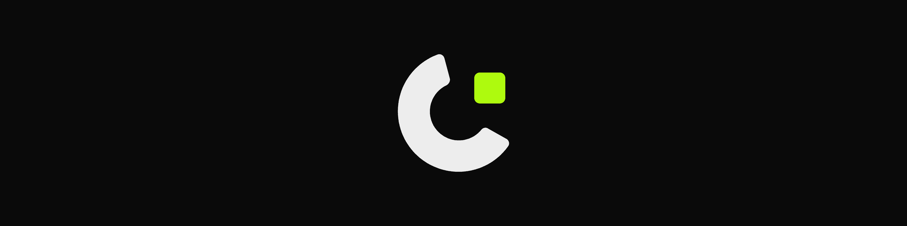
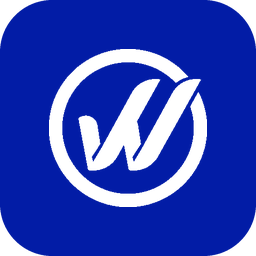
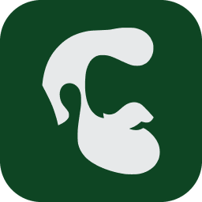
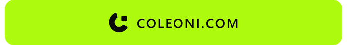

## About me

I'm an AI engineer and full-stack developer, more architect than code typist. Most of my work happens before the first commit: deciding what actually needs to exist and how the pieces fit together. The typing part I increasingly hand to agents.

Right now most of my time goes to LLM agents, multi-agent orchestration and automation that has to survive real users on the other side.

## Projects

<table>
<thead>
<tr>
<th align="left">Project</th>
<th align="left" width="45%">What it is</th>
<th align="left" width="34%">Stack</th>
</tr>
</thead>
<tbody>
<tr>
<td nowrap>&nbsp;<b><a href="https://wcheckbrasil.com.br">W Check Brasil</a></b></td>
<td>Vehicle lookup and credit analysis platform, 13k+ clients</td>
<td><kbd>Next.js</kbd> <kbd>NestJS</kbd> <kbd>PostgreSQL</kbd> <kbd>Redis</kbd> <kbd>AWS</kbd></td>
</tr>
<tr>
<td nowrap>&nbsp;<b><a href="https://trimos.app">TrimOS</a></b></td>
<td>Management SaaS for barbershops: schedule, clients, services, billing and an AI assistant</td>
<td><kbd>React</kbd> <kbd>TypeScript</kbd> <kbd>Express</kbd> <kbd>MySQL</kbd></td>
</tr>
</tbody>
</table>

<!-- Nova linha: salve a logo 256x256 em assets/projects/ e copie o bloco <tr> acima. Guia: assets/projects/README.md -->

## Let's talk

